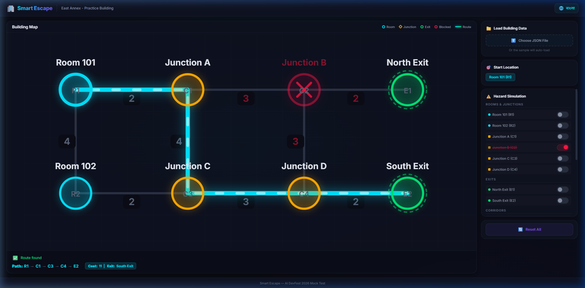

# 🚨 Smart Escape — Interactive Evacuation Route Simulator

An intelligent, interactive building evacuation route simulator built with pure frontend web technologies (HTML5, CSS3, Vanilla JavaScript). The application models indoor spaces as graphs, applies Dijkstra's algorithm with deterministic tie-breaking to compute optimal emergency escape routes, and dynamically adapts in real-time to hazard conditions such as blocked rooms, impassable corridors, and closed emergency exits.

Developed for **AI DevFest 2026 — Vibe Coding Contest**.

---

## 👤 Participant Information

- **Name:** Hadiuzzaman
- **Registration / Student ID:** [Your Reg ID here]
- **Department:** Computer Science & Engineering
- **Live Demo Link:** [https://hadiuzzaman304.github.io/Smart-Escape/](https://hadiuzzaman304.github.io/Smart-Escape/) *(or your deployed URL)*

---

## 📸 Screenshots

### 1. Baseline Evacuation Route (Room R1 → Exit E1)


### 2. Hazard Reroute (Corridor C2 Blocked → Rerouted to Exit E2)


---

## ✨ Features Implemented

### 1. Robust Graph & Data Validation
- Accepts custom building topology in JSON format.
- Comprehensive structural validation: validates node types (`room`, `junction`, `exit`), coordinate ranges, positive edge costs, no self-loops, no duplicate edges, and valid initial hazard states.
- Friendly error displays for invalid or corrupted JSON files.

### 2. Interactive SVG Visualization
- Nodes rendered at designated Cartesian coordinates with labels and IDs.
- Distinct color-coded nodes:
  - 🔵 **Cyan**: Rooms
  - 🟡 **Amber**: Junctions / Intersections
  - 🟢 **Green**: Emergency Exits
  - 🔴 **Red Glow & ✕**: Hazard / Blocked Nodes
- Dynamic edge styling with corridor traversal costs displayed at midpoints.
- Active evacuation path highlighted with high-contrast glowing lines and pulsating directional indicators.

### 3. Real-Time Hazard Simulation & Control Panel
- **Interactive Toggles:**
  - Block / Unblock Rooms & Junctions
  - Block / Unblock Individual Corridors (Edges)
  - Close / Reopen Emergency Exits
- Instant route recalculation upon any state modification without requiring file reloads.
- Visual differentiation of disabled corridors (red dashed lines).
- One-click **Reset to Initial State** button.

### 4. Deterministic Dijkstra's Algorithm
- Weighted shortest path calculation adhering strictly to contest specifications:
  - Total path cost = sum of traversed corridor weights.
  - Fully removes blocked rooms, junctions, closed exits, and blocked corridors.
  - **Exit Tie-Breaking:** Selects minimum total cost exit; ties broken by lexicographically smaller exit ID (e.g., `E1` over `E2`).
  - **Path Tie-Breaking:** Breaks intermediate path ties using lexicographical order of node IDs.
  - Edge cases gracefully handled: displays clear alerts if no route is reachable or if the user's start room itself is compromised.

### 5. Internationalization & Accessibility
- Full bilingual support with instant toggle between **English** and **বাংলা (Bangla)**.
- Dark mode theme optimized for maximum contrast and visual appeal.

---

## 🚀 How to Run Locally

Because the project uses standard Web APIs and module-free Vanilla JavaScript, no build step or package manager is required.

### Method 1: Using Python Built-in HTTP Server (Recommended)
```bash
# Clone the repository
git clone https://github.com/Hadiuzzaman304/Smart-Escape.git
cd Smart-Escape

# Start a local web server
python -m http.server 8080
```
Open your browser and navigate to: `http://localhost:8080`

### Method 2: Using Node.js `npx serve` or `http-server`
```bash
npx serve .
```

### Method 3: VS Code Live Server
Right-click on `index.html` and select **"Open with Live Server"**.

---

## 📁 Repository Structure

```text
├── index.html              # Main single-page application structure & semantic layout
├── style.css               # Modern glassmorphism dark-theme design system & animations
├── app.js                  # Graph logic, Dijkstra algorithm, SVG renderer & state store
├── building.json           # Sample building floor plan and hazard specification
├── LICENSE                 # MIT License
├── README.md               # Project documentation and contest report
└── screenshots/
    ├── baseline_route.png      # Baseline optimal evacuation path
    └── c2_blocked_reroute.png  # Automatic reroute visualization under corridor hazard
```

---

## 🤖 AI Tools & Prompts Used

- **Primary AI Assistance:** Google Antigravity IDE (Gemini Models & Agentic pair programming)
- **Workflow:**
  - Automated deep requirement parsing from contest PDF rulebook and problem statements.
  - Algorithmic implementation of deterministic Dijkstra with graph DAG forward tie-breaking.
  - Subagent-driven browser visual validation across edge cases (blocked start, blocked exits, corridor hazards).
- **Most Effective Prompt:**
  > *"Analyze the problem statement hazard semantics and tie-breaking rules. Implement Dijkstra's algorithm such that when multiple exits or equal paths have identical minimal costs, ties are resolved deterministically in lexicographical order, while edge cases (like blocked start node or all exits closed) display clear contextual feedback without throwing runtime errors."*

---

## 📄 License

This project is licensed under the [MIT License](LICENSE).
