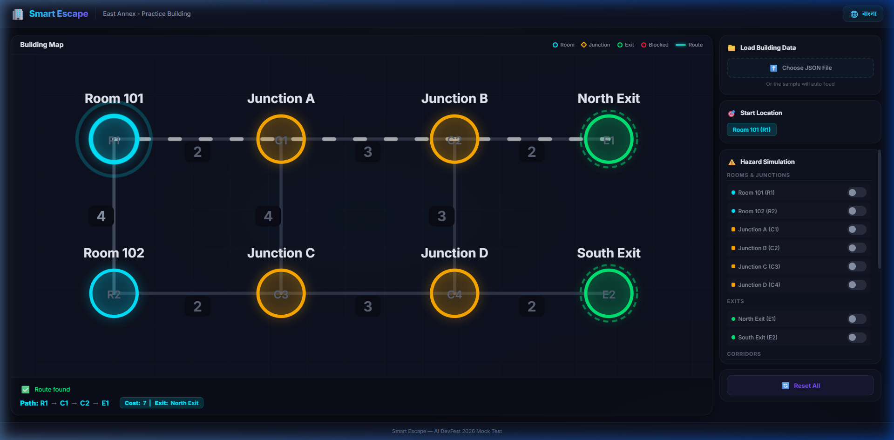
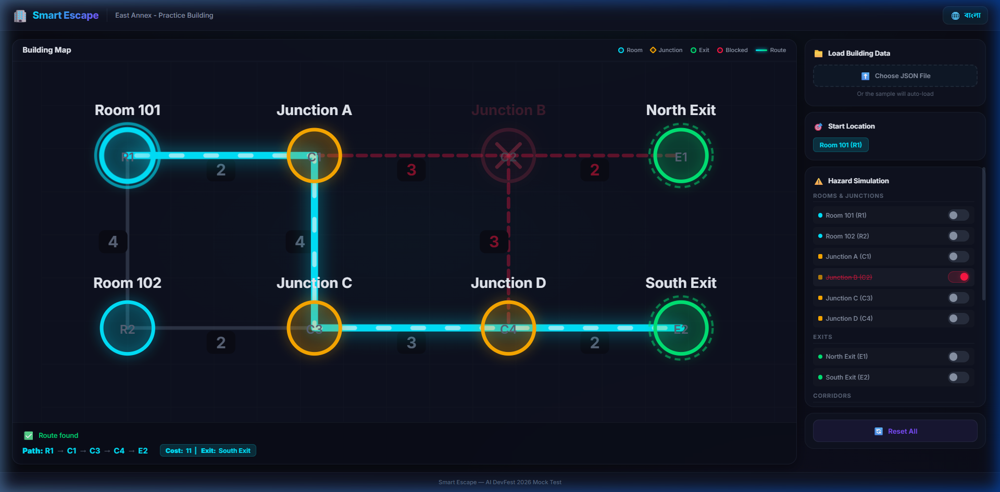

# Smart Escape — Interactive Evacuation Route Simulator

> AI DevFest 2026 Mock Test | Vibe Coding Contest

## 👤 Participant

- **Name:** Hadiuzzaman
- **Registration Number:** 232-15-304
- **Live Website:** *(deployment link here)*

## 🚀 How to Run

1. Clone the repository
2. Open `index.html` in a browser, or serve with any static server:
   ```bash
   python -m http.server 8080
   ```
3. Open `http://localhost:8080` in the latest Google Chrome
4. The sample `building.json` auto-loads on start
5. To test with a different building file, use the "Choose JSON File" button

## ✅ Implemented Features

### Mandatory Features
- **Import & Validate JSON** — Full validation (node count, edge limits, self-loops, duplicate pairs, category matching)
- **Interactive Graph Display** — All nodes rendered at supplied coordinates with labels, IDs, and distinct type colors
- **Shortest Path Routing** — Dijkstra's algorithm with proper edge-cost summation
- **Lexicographic Tie-Breaking** — Smallest exit ID on cost ties; smallest node-ID path on path ties
- **Hazard Simulation** — Block/unblock rooms, junctions, corridors; close/reopen exits via toggle switches
- **Instant Recalculation** — Route updates immediately on every hazard or start change
- **Reset to Initial State** — Restores the file's original `initial_state` without reimporting
- **Failure Cases** — "No route available" and "Starting location blocked" messages
- **Bangla + English** — Full bilingual toggle for all UI labels, buttons, statuses, and instructions
- **Subtle Animations** — Node selection pulse, route flow animation, smooth state transitions

### Visual Design
- Premium dark cyberpunk theme with glassmorphism
- Neon-glowing nodes (cyan rooms, amber junctions, green exits, red blocked)
- Animated route highlighting with flowing dash effect
- SVG glow filters for depth and atmosphere
- Fully responsive layout

## 🎁 Bonus Features
- Custom JSON file upload for unseen datasets
- Corridor-level blocking (individual edge toggles)
- Blocked node visual feedback (✕ cross, cursor not-allowed, desaturation)
- Edge blocking visuals (red dashed lines for blocked corridors)

## ⚠️ Known Issues
- None currently known — all 5 test cases pass

## 🤖 AI Tools Used
- **Antigravity IDE** (Claude Opus 4.6 + Gemini 3.1 Pro)

## 💡 Most Useful Prompt

> "Analyze the problem statement deeply. Build an interactive evacuation route simulator with Dijkstra's algorithm, hazard simulation with instant rerouting, Bangla/English toggle, and a premium dark theme UI. Use SVG for the graph with neon-glowing nodes, animated route highlighting, and glassmorphic control panels. Implement full JSON validation and lexicographic tie-breaking for paths."

## 📸 Screenshots

### Baseline Route (R1 → E1, cost 7)


### Rerouted after blocking C2 (R1 → E2, cost 11)


## 📄 License

This project is licensed under the [MIT License](LICENSE).
